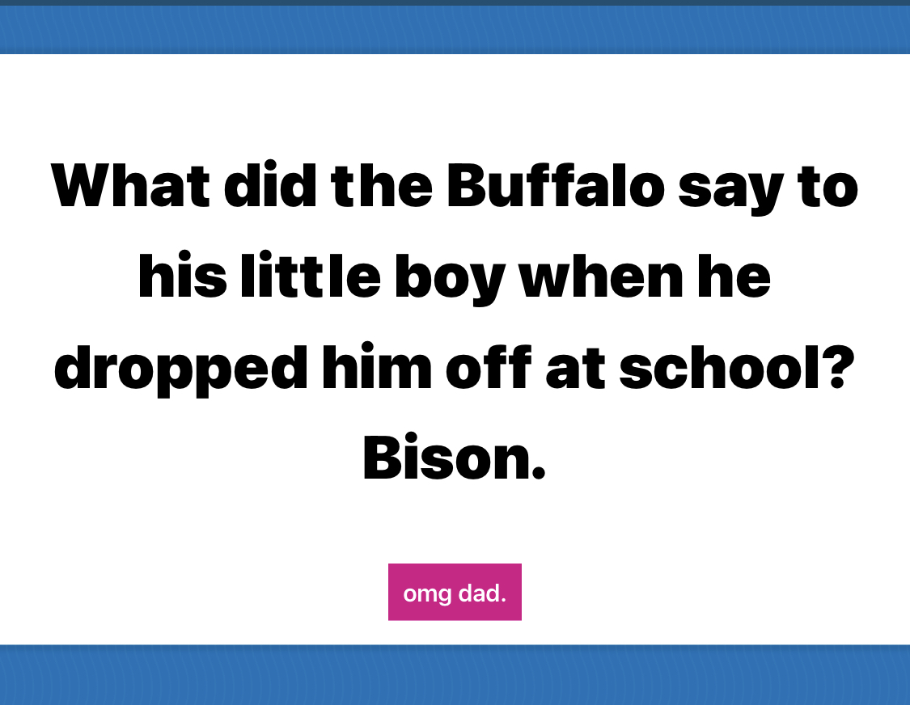

## A Random Joke Generator via an API

## Live Demo

https://webdevbrum.github.io/dad-jokes/

## Getting Started

No pre requisite installation required. Built using HTML CSS and Vanilla JavaScript.